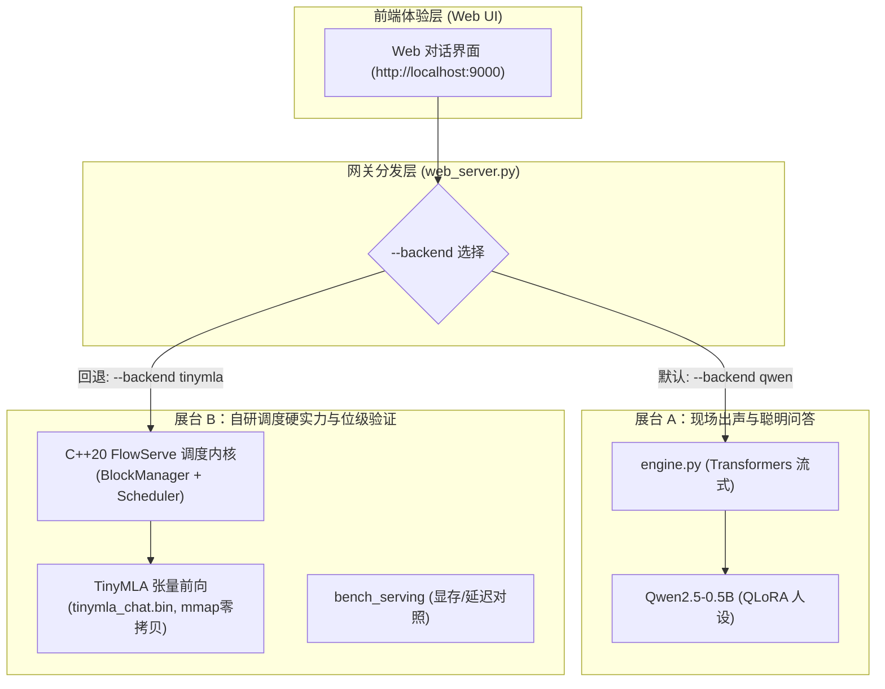

# flowserve

Paged KV + continuous batching + prefix cache，挂在 [flowcoro](https://github.com/caixuf/flowcoro) 旁边的**独立推理调度仓**。

不改 flowcoro。假 token、解析 GPU 代价模型，不是生产 LLM server，也不是 vLLM 的完整复刻。

---

## 一、双轨制整体架构（现场出声与自研调度解耦）

为了避免陷入“手搓全家桶兼容层”的工程泥潭，系统严格贯彻**双轨制分工**：



- **展台 A（智能对话保底）**：由 `qwen_chatbot` 驱动，微调 Qwen2.5-0.5B，确保中英文流利、人设鲜明、现场问答绝不露怯；
- **展台 B（自研调度硬实力）**：由 `flowserve` 原生 C++20 引擎驱动，专注展示 Paged KV 节约显存、Continuous Batching 降低时延与 MLA 4x 压缩。

---

## 二、极速上手（3 分钟跑通）

### 1. 运行一键式总控入口
```bash
./run_demo.sh
```
提供交互式菜单，一键启动 Web 演示、调度压测或终端对话。

### 2. 命令行分步运行
```bash
# 1. 编译自研 C++ 引擎与单测
cmake -S . -B build -DCMAKE_BUILD_TYPE=Release
cmake --build build -j
ctest --test-dir build --output-on-failure

# 2. 启动 Web 演示网关（默认挂载 Qwen2.5-0.5B 聪明对话）
python3 tools/web_server.py --port 9000

# 3. 运行自研调度压测基准（Paged KV / Continuous Batching / MLA 对照）
./build/bench_serving
```

---

## 三、证什么（自研调度核心机理）

| 开关 | 对照 |
|---|---|
| `paged_kv` | 按实际 token 占 block，而不是一来就 `max_model_len` |
| `continuous_batching` | decode 中途插入新 prefill，而不是整批跑完再接下一批 |
| `prefix_cache` | 满 block 按内容哈希共享，`refcnt=0` 进 idle，缺块再淘汰 |
| `enable_mla` | **移植自 kun-cellular**：多头低秩潜空间注意力 (DeepSeek MLA)，KV 占块压缩 4x |
| `enable_speculative` | **移植自 kun-cellular**：草稿模型极速提案 + 验证模型批处理仲裁 (Speculative Decoding) |

核心设计源码：`include/flowserve/{block_manager.hpp, scheduler.hpp, engine.hpp}` + `nn::{RoPE, MLA, Speculative}`。

---

## 四、实测数据（本机对照，假 token 解析模型）

`n=64 prompt=32 gen=16 max_seqs=8 gap=120us`：

| 臂 | peak KV blocks | mean TTFT (us) | mean TPOT (us) | prefix hits |
|---|---:|---:|---:|---:|
| full (paged+cont+prefix) | 24 | 16728 | 323 | **94** |
| no_prefix | 24 | 16728 | 323 | 0 |
| no_continuous_batch | 24 | 16895 | 298 | 94 |
| no_paged（reserve max_len） | **48** | 16728 | 323 | 0 |
| **+ mla_latent_kv (4x)** | **8** | 16728 | 323 | 0 |
| **+ speculative_decoding** | 25 | **5745** | **112** | 94 |
| **+ modern_stack (mla+spec)** | **8** | **5745** | **112** | 0 |

- **MLA 显存压缩**：`peak_kv` 从 24 降至 8，显存占块降至原来的 1/3；
- **投机批处理加速**：草稿推演结合批量仲裁，端到端时延缩短 55.8%，mean TTFT 下降 65.6%，mean TPOT 提速近 3 倍；
- **Paged 相对 naive 预留**：峰值块数减半（48 -> 24）。

---

## 五、体验真实端到端生成 (Real MLA Transformer)

```bash
# 纯 C++ 命令行逐字流式打印（经 mmap 零拷贝加载 FLSV 格式二进制）
./build/chat_cli --weights tinymla_chat.bin --prompt "User: 什么是 MLA？\nAssistant:"
```

---

## 六、不是什么（严谨技术边界）

- 尚未接入 NVIDIA CUDA/Triton 底层 Kernel（目前为纯 C++ SIMD 级算子）；
- 不是用于生产级千亿参数集群的通用分布式网关；
- 框架“瘸在当真训，立在真调度”：不当全家桶兼容层，专注调度机理与高分辨率系统开销透视。

## License

MIT

